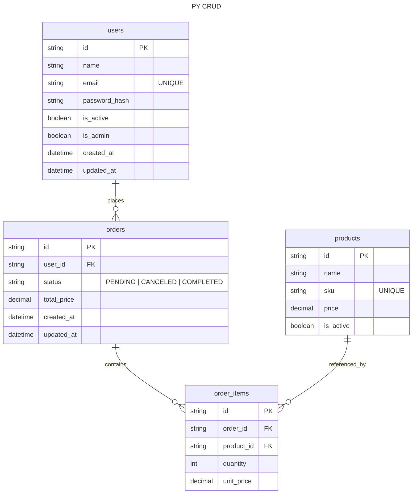

# PY CRUD

**Isekai title**: That Time I Created an API with [FastAPI](https://fastapi) and Python So I Wouldn´t Be Stuck with Just JavaScript.

> Attention: This repository was created solely for study purposes and has no intention of being useful in any way.

---

## Summary

[Installation](#installation)

## Installation

This project requires Python 3.8+ and uses a `requirements.txt` file to manage dependencies. Follow the steps below to set up your environment and install the necessary packages.

### 1. Set up a Virtual Environment (Recommended)

It is highly recommended to use a virtual environment to avoid conflicts with other global packages.

```bash
# Create a virtual environment
python -m venv venv

# Activate the virtual environment
# On Windows:
venv\Scripts\activate
# On macOS/Linux:
source venv/bin/activate

```

### 2. Install Dependencies

Once the virtual environment is active, run the following command to install all required libraries:

```bash
pip install -r requirements.txt

```

### Dependencies Overview

The project relies on the following core libraries:

- **FastAPI**: For building the web API.
- **Uvicorn**: An ASGI web server implementation for Python.
- **SQLAlchemy**: For database ORM mapping.
- **Pydantic**: For data validation and settings management.
- **Python-jose & Passlib**: For handling JWT authentication and password hashing.

| Package        | Version |
| -------------- | ------- |
| `fastapi`      | 0.128.0 |
| `uvicorn`      | 0.40.0  |
| `pydantic`     | 2.12.5  |
| `sqlalchemy`   | 2.0.46  |
| `cryptography` | 46.0.4  |

---

## Database

### Variables

```

```

### Diagram (DER)



---
